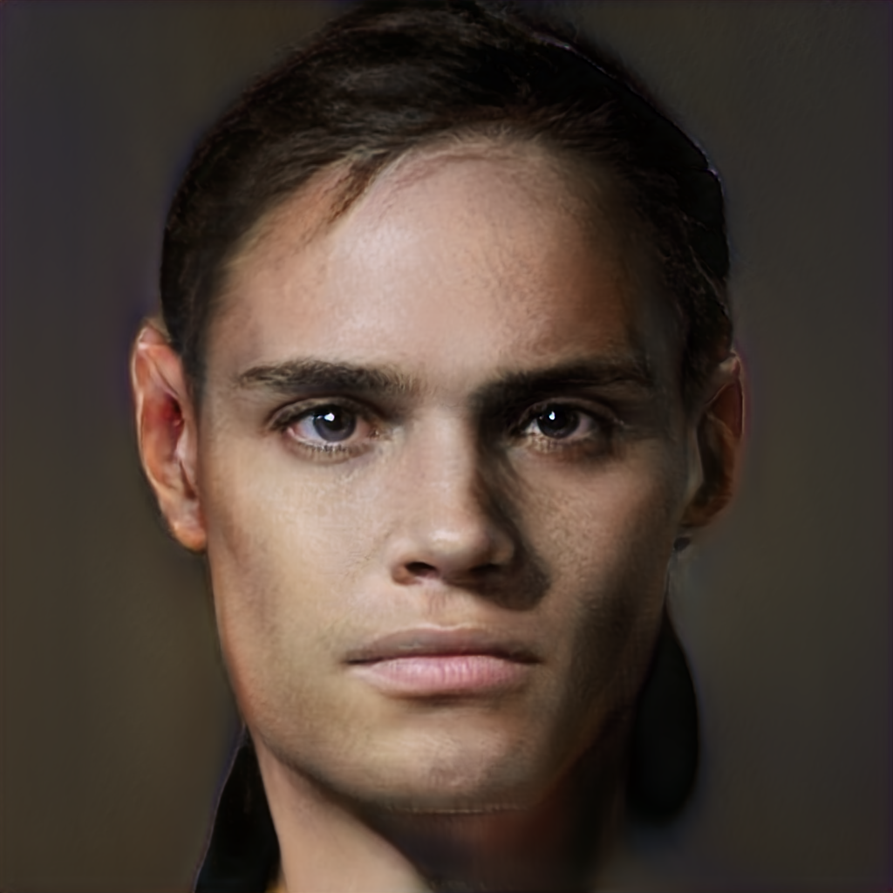

# EGO of LOLA

## Learning exercise

[Create an account at Playform](http://fbuy.me/rB95k) (please use this link). Provide all your details, you will receive 15$ worth of training time (you will need this).

Before we start, let's understand Machine Learning through a simple exercise.

In Playform:

1. Visit https://create.playform.io/my-stylize-projects
2. **Create new project**
3. Select **Stylize**
4. Watch the video
5. Click **Create Project**
6. Click Upload Image and select a personal profile image
7. Under **Pre-defined Styles** select any of the option
8. Click **Generate Image**
9. Wait a bit
10. Hover the generated image and click **Download**
11. Name the file **PROFILE_XX.png** eg. **PROFILE_JJ.png**
12. [Upload here](https://bit.ly/3foQRin)

Now we're ready!

## Visual

Divide into four groups with a theme:

1. Head
2. Torso
3. Leg
4. Feet

### Gather images and create a collection

Explore your theme and gather a minimum of 30 images. The images should be similar, but not identical. Use https://same.energy/ (or Google Images) and the [Download All Images Chrome extension](https://chrome.google.com/webstore/detail/download-all-images/ifipmflagepipjokmbdecpmjbibjnakm).

In Playform:

1. Visit https://create.playform.io/my-collections
2. **Create a new collection**
3. Upload your images
4. Give your collection a title
5. Make it public
6. Choose a fitting category
7. Add the tag "basement9"
8. **Save changes**

### Create a project and start training

In Playform:

1. Visit https://create.playform.io/my-projects
2. **Create a new project**
3. Click **Freeform**
4. Watch the video
5. Click **Add Collection**
6. Click **Use one of my collections**
7. Select your collection
8. Click **Add to inspiration**
9. Click **Begin training**
10. Set training time to minimum 1 hour. Then **Begin Training**.

### Create a latent space walk video

1. Visit https://create.playform.io/my-projects
2. Wait for the training to complete…
3. Select your project
4. Click **Video**
5. Click **Create New Clip**
6. Select the first image of your video and **Add Image As Keyframe**
7. Select 6 more images and repeat the process. The last image should be the same as the first.
8. In the timeline, set the **Transition** to 00:10:00 ie. 10 seconds.
9. Click **Finalize Clips**
10. Click **Generate Clip**
11. Wait for it to render the clip…
12. Download the clip
13. Name the clip **VISUAL_THEME_XX_01.mp4** eg. **VISUAL_HEAD_JJ_01.mp4**. If you make several, increment the suffix.
14. [Upload here](https://bit.ly/3foQRin)

## Vocal

Each participant watches this: https://coda.io/@overdub/overdub-scripts and receives a script to read.

Then:

1. Record yourself speaking the script.
2. Name the recording **VOCAL_XX_YY** (MP3/M4A/WAV) eg. **VOCAL_01_JJ**. The prefix identifies your part of the script.
3. [Upload here](https://bit.ly/3foQRin)

## Text

Each participant explores https://openai.com/ and researches a manifest or poem of meaning. Must be in English.

Then:

1. Visit https://bellard.org/textsynth/
2. Paste the poem in the textarea
3. Select **Large** under **Model**
4. Click **Complete Text**
5. Click **More** to continue, or **Generate another** to start over
6. Create a text file
7. Add 1-5 paragraphs and save
8. Name the file **TEXT_XX.txt** eg. **TEXT_JJ.txt**
9. [Upload here](https://bit.ly/3foQRin)

Read https://bellard.org/textsynth/tech.html to learn about the parameters.

## Congratulations

You've successfully accomplished all the steps.

Rest.

## Learning exercise
